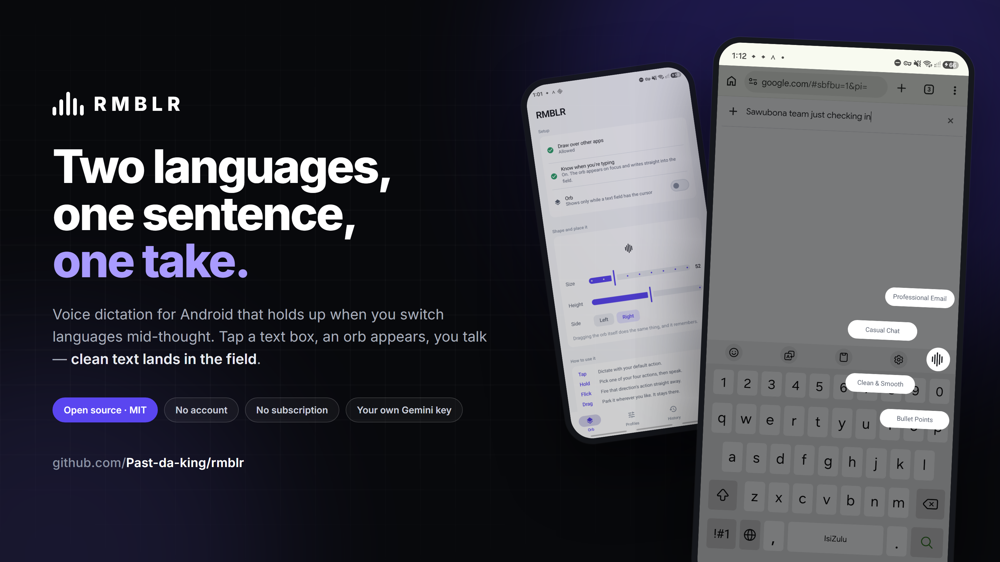
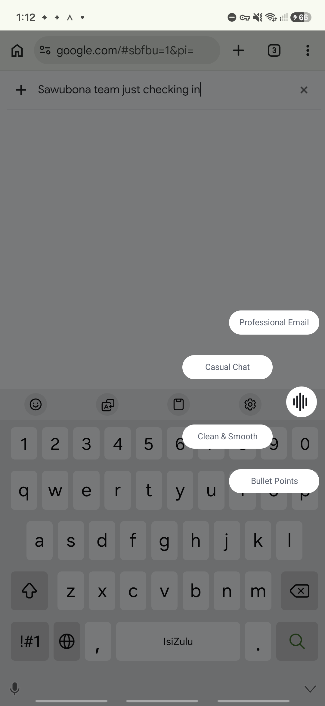
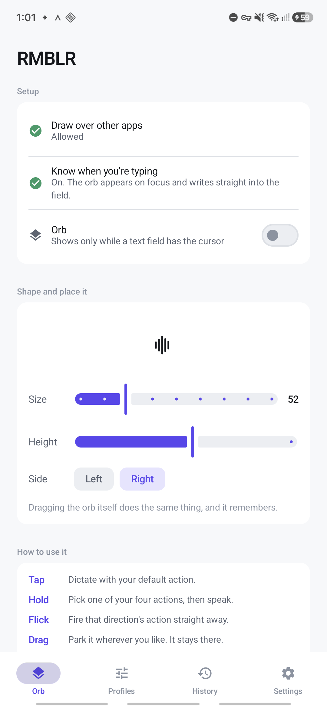
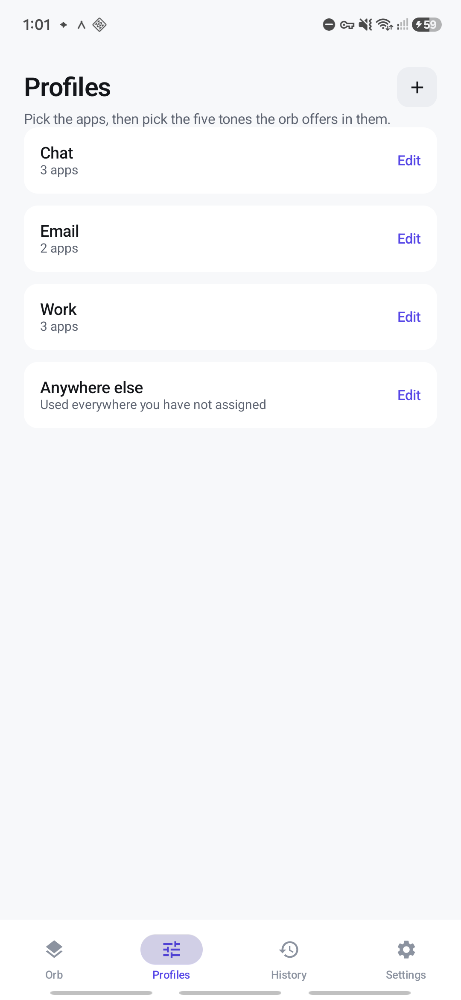

# RMBLR

Speak into any Android app. RMBLR writes it down, tidies it up, and puts the text
straight into the box you were typing in — in your language, or in someone else's.

Double tap the orb and it translates instead: say it in English, have it land in
Japanese, Spanish, isiZulu or anything else, straight into WhatsApp.

No account. No subscription. Your own API key, talking directly to whichever model
you pick — Gemini, Groq, Mistral, OpenRouter, OpenAI, or any OpenAI-compatible
endpoint you host yourself.

**[Download the latest APK →](https://github.com/Past-da-king/rmblr/releases/latest)**

---

## What it does

A small orb appears **only when a text field has the cursor** — never sitting on your
home screen. From there:

| Gesture | What happens |
|---|---|
| **Tap** | Dictate. The transcript is written into the field. |
| **Hold** | An arc of tones fans out. Slide to one, release, speak. |
| **Flick** | Fires that direction's tone immediately, skipping the menu. |
| **Drag** | Park it anywhere. It remembers. |

### Per-app profiles

The tones on the arc change with the app you are in. WhatsApp offers casual ones,
Gmail offers professional ones, Slack sits in between. Pick the apps and the tones
once, in the Profiles tab.

### Your own tones

A tone is a name and a system prompt, nothing more. The built-ins are a starting
point — write your own ("Rewrite this as a short LinkedIn post, no hashtags") and it
appears on the arc alongside them.

### A dictionary of your own words

Names, places and jargon get guessed at, and differently every time. Add them once and
they are handed to whichever engine is running before it hears anything — with an
optional spelling for the ones that never come out right. The list suggests itself from
what you have already dictated, so you tap rather than type.

### Translate what you copy

Optional, and off until you switch it on. Copy any text and the orb appears wearing a
translate glyph; tap it and the translation comes back in a bubble you can read or
copy. It goes away again a minute later.

The clipboard is read **at the moment you tap and at no other time**. Android does not
let an app read the clipboard in the background, and RMBLR does not try to work around
that — it borrows input focus for a fraction of a second on your tap, reads, and hands
focus straight back.

---

## What it looks like

| The arc, over whatever you were typing in | Size, placement, permissions | Per-app profiles |
|---|---|---|
|  |  |  |

---

## Setup

1. **Draw over other apps** — so the orb can sit above what you are typing in.
2. **Accessibility → RMBLR orb** — the only Android API that can tell an app a text
   field has focus, and write text back into another app's field. Without it the orb
   cannot appear on cue and can only copy to the clipboard.
3. **A Gemini API key** — free to start, from
   [Google AI Studio](https://aistudio.google.com/apikey). Paste it on the last
   onboarding page or in Settings.

The key is stored on your device and used to call Google directly. Nothing is routed
through any server of ours, because there isn't one.

---

## Models

Transcription is a choice between three engines, in Settings.

| Engine | What you get | Tones |
|---|---|---|
| **Gemini Transcribe Live** (default) | Built for this one job. Words appear while you speak, and it answers in text rather than speech — so no spoken reply is generated, waited for, or billed. | No |
| **Gemini Flash Lite** | Cheap and accurate, handles switching languages mid-sentence, and the one to pick when you want a tone. | Yes |
| **Gemini Live** | The previous streaming model, kept so nobody's choice vanishes. It generates a spoken answer that is thrown away unheard and billed anyway. | No |
| **Groq** | Whisper Large v3 Turbo, Whisper Large v3, or Distil-Whisper. Fast and free to start, but Whisper is weaker across two languages in one sentence. | Yes |
| **Mistral** | Voxtral, Mistral's own transcriber, strong across European languages. | Yes |
| **OpenAI** | GPT-4o Transcribe, GPT-4o Mini Transcribe, or Whisper. | Yes |
| **OpenRouter** | One key reaching all of the above and more. Name whichever model you want. | Yes |
| **Anything OpenAI-compatible** | Your own base URL and model — a self-hosted Whisper, a company gateway, anything answering `/audio/transcriptions`. | Yes |

A key belongs to a provider and is entered once: the same Mistral key does your dictating
and your translating.

Transcription is not the part that needs a large model, so the default is the cheapest
one that does the job well. If it is out of quota the client walks down a fallback
chain rather than losing what you said.

**The streaming engines send audio as you speak.** The socket opens when you press,
audio goes up in 200ms chunks, and the transcript accumulates while you are still
talking — there is no upload after you stop.

`gemini-3.5-transcribe-live` is the one to use. It accepts a TEXT response modality and
refuses AUDIO, which means it returns the transcript and nothing else: no spoken reply
is generated, so none is billed. The older speech-to-speech Live model is the exact
reverse — it refuses TEXT, and produces an answer for every dictation that nobody hears
and everybody pays for.

Neither can rewrite text, so tone actions are unavailable while streaming. The app says
so rather than quietly ignoring your tone.

### Languages

You type it. A language is only a name handed to the model, so there is no list to hunt
through and nothing to be missing from — write "isiZulu" or "Setswana" or anything else
and it becomes context for the transcriber. Leave it blank for auto.

Whatever Gemini can hear, which is considerably more than its documented list — the
language this was built for is not on that list and transcribes fine. Leave the
language picker on **auto** unless you are being transcribed into the wrong language.

### Translation providers

Translation can run on Gemini, **Mistral, OpenRouter, Groq, OpenAI — or anything that
speaks the OpenAI chat-completions API**, including a server on your own machine. Give
it a base URL and a model name.

---

## Appearance

Light, dark, or **OLED black** — true `#000000`, so the pixels are switched off on an
OLED panel. **Material You** is on by default from Android 12: the app takes its
palette from your wallpaper. OLED black keeps its black background and borrows only
the accent colour.

---

## Building

```bash
git clone https://github.com/Past-da-king/rmblr.git
cd rmblr
./gradlew assembleDebug
```

A debug build needs no configuration. For a signed release, create
`keystore.properties` in the project root:

```properties
storeFile=your-release.jks
storePassword=...
keyAlias=...
keyPassword=...
```

Both that file and any `*.jks` are gitignored. Without it, `assembleRelease` simply
produces an unsigned APK.

**Requirements:** Android 7.0+ (API 24), compiled against API 37. Built with Kotlin and
Jetpack Compose, styled to Material 3 Expressive.

---

## Licence

MIT. See [LICENSE](LICENSE).
